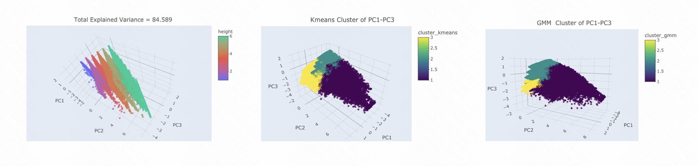
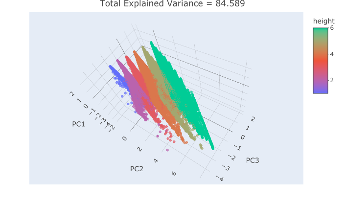
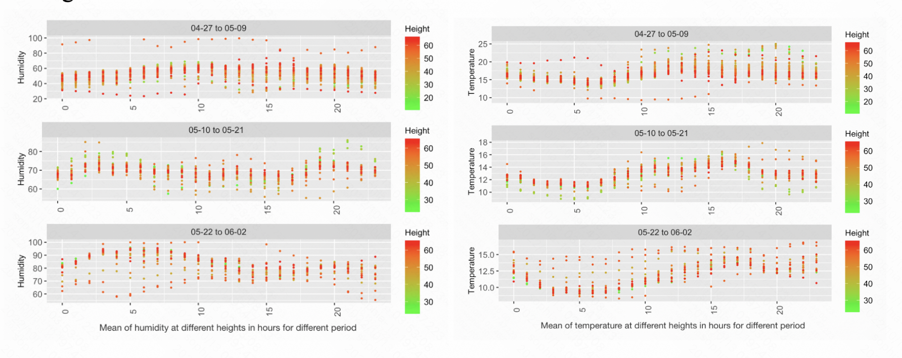

```{r setup, include=FALSE}
knitr::opts_chunk$set(echo = FALSE, warning = FALSE,fig.align='center')
library(dplyr)
library(ggplot2)
library(tidyverse)
require(tibble)
library(hrbrthemes)
library(scales)
library(units)
library(hablar)
library(ggcorrplot)
library(plotly)
library(ClusterR)
library(ggpubr)
library(maditr)
library(RColorBrewer)
library(corrplot)
```


# Abstract


While the original 2005 paper was a preliminary study of the macroclimate of Sequoia trees along the California coast using wireless sensor networks, this report thoroughly examines the Sequoia dataset differently, focusing mainly on the preparation and cleaning before starting the data analysis. There are five sections: raw data collection, data cleaning, data exploration, interesting findings, and conclusions.

# **1. Data Collection**

## **a.Paper Summary**

The thesis focuses on the ecophysiology of Sonoma redwood trees in California using wireless sensor networks to explore the microclimate's complex spatial variability and temporal dynamics around coastal redwood trees. Air temperature, relative humidity, and photosynthetically active solar radiation (PAR) were monitored every 5 min for 2 m for 44 days during the early summer of the redwood tree's life by placing magnetic suction sensors on a 70 m high redwood tree. The paper describes the placement of magnetic suction sensors, one sensor every 2 m from 15 m to 70 m above ground. Since the canopy is thicker on the western side of the redwood tree, the sensors are located on the western side. Sensors were also placed at 0.1-1.0 m from the trunk to ensure that the trees' microclimate trends could be captured directly.

Moreover, TASK and TinySQL software serve as the framework for collecting and processing the data. The first phase investigates the extent and distribution of the data independent of time and space by transforming a 3-dimensional dataset with a temporal dimension, a spatial dimension, and a dimension related to the sensor values themselves into a 1-dimensional dataset; the second phase adds a temporal dimension to investigate the temporal trend of the data can be seen in the weather over the time scale with a temporal gradient. The third phase investigates the spatial trend of the data based on the 1-dimensional dataset. The third stage examines the spatial trend of the data based on a 1-dimensional dataset, where the trend in height helps to derive a theoretical model of canopy density and the existence of a spatial gradient in tree height. The last stage examines the three-dimensional data, and we contrast the sensor values by shades of color in different times and spaces. Through humidity graphs, the dense canopy can have a buffering effect on the lower part of the tree.

## b.
### **i.Sensor Deployment Mode**

Since early summer contains the most dynamic microclimate variability, we decided that sampling all sensors every 5 minutes would be sufficient to capture this variability for a month. tolle placed the sensors from 15 m above ground to 70 m above ground, with a spacing between nodes of approximately 2 m. This spatial density ensured that we could capture the gradients in sufficient detail to interpolate accurately. Simultaneous placement of the envolop starts at 15 m because most of the leaves are in the upper part of the tree. We primarily measured the western side of the tree, which has a thicker canopy and provides the greatest buffer against the direct effects of the environment. Not only that, but we also placed the sensors 0.1-1.0 m away from the trunk of the tree. These nodes were placed very close to the trunk to ensure that we captured the microclimate trends that directly affect the tree rather than the broader climate. figure 1 in the Tolle article shows the final position of each node in the tree. We also placed several nodes outside of the angular and radial envelopes to monitor microclimate near other previously installed biosensing devices.

### **ii.Summary of the Dataset**

The collection includes measurements made over 44 days, from April 28, 2004, to June 10, 2004, in Sonoma County on two trees (the interior and the periphery). Since the edge tree only has around one-fourth as many data points as the interior tree and the edge tree was not covered in the original publication, this report will mainly concentrate on the inner tree with 33 sensor nodes. Every 5 minutes, the 33 sensor motes, which were mounted on the redwood tree at a height of 15 to 70 meters, took readings for humidity, temperature, PAR (photosynthetically active radiation), and reflected PAR. Each mode's log files on the disk included the collected measurements, which were also sent to researchers through the GPRS network (net data). Prior to deployment, each mote was calibrated to guarantee the precision of the measurements. Mote-location-data.txt is a text file that stores each sensor mote's profile. Each mote's height, angular position, and distance from the stem were noted, allowing for a multi-dimensional study and subletting to the interior of the tree.

# **2.Data Cleaning**

```{r}
#read data
#df_all = read.csv("data/sonoma-data-all.csv",header=TRUE,stringsAsFactors=FALSE)
df_loc = read.csv('data/mote-location-data.txt',header=TRUE,stringsAsFactors=FALSE,sep='')
# df_all$result_date = format(as.POSIXct(df_all$result_time), format="%Y-%m-%d")
# df_all$result_second = format(as.POSIXct(df_all$result_time), format="%H:%M:%S")
df_net = read.csv("data/sonoma-data-net.csv",header=TRUE,stringsAsFactors=FALSE)
df_log = read.csv("data/sonoma-data-log.csv",header=TRUE,stringsAsFactors=FALSE)


#change dataframe to tibble
#df_all = tibble(df_all)
df_loc = tibble(df_loc)
df_net = tibble(df_net)
df_log = tibble(df_log)

#add a new column to distinguish between net and log
df_net = df_net%>%mutate(type = 'net')
df_log = df_log%>%mutate(type = 'log')

#correct log time
df_net = df_net%>%mutate(actual_time= result_time)
df_log = df_log%>%mutate(actual_time= as.POSIXct("2004-04-27 17:10:00")+epoch*300)

#extract date
df_net$actual_date = as.Date(format(as.POSIXct(df_net$actual_time), format="%Y-%m-%d"))
df_log$actual_date = as.Date(format(as.POSIXct(df_log$actual_time), format="%Y-%m-%d"))

#merge df_log and df_net
df_net_log = rbind(df_log, df_net)

#merge df_all and df_loc
#df_all_loc = df_all%>%left_join(df_loc,by = c("nodeid"="ID"))
df_net_log_loc =  df_net_log%>%left_join(df_loc,by = c("nodeid"="ID"))


#Drop NAs
df_net_log_NA = df_net_log%>%na.omit()

#Process the data using the data range given in the article(40w->25w)
##voltage in [2.4,3]
##humidity in [0, 100]
df_net_log_NA_filter = df_net_log_NA%>%filter(voltage<3,voltage>2.4,humidity>16.4,humidity<102)
df_log_filter = df_log%>%filter(humidity>16.4,humidity<100.2)
#use inner join to filter outlier nodeid
df_net_log_NA_filter_loc = df_net_log_NA_filter%>%inner_join(df_loc,by = c("nodeid"="ID"))
```

## **a.Check Histogram**

Before plotting the histogram, we initially filtered the variables according to the  range in Tolle's table1 for each sensor and range of voltage, removed the NA, controlled the local log voltage at (2.4, 3), network voltage at (200, 250), then controlled the temperature at (6.6, 32.6) and humidity at (16.4, 100.2). Also, because the time is a trash, we also corrected the time.


```{r, fig.width = 6,fig.height = 3,fig.align="center",fig.cap="Data Distribution over Time by Log and Net"}
#histogram
#Use origin data
#1)overall review
# Represent it
library(ggplot2)
p <- df_net_log %>%
  ggplot(aes(x=actual_date, fill=type)) +
    geom_bar( color="#e9ecef", alpha=0.6, position = 'identity') +
    scale_fill_manual(values=c("#69b3a2", "#404080")) +
# Format : Week
scale_x_date(labels = date_format("%m/%d"),breaks = '5 days') +
  theme(axis.text.x = element_text(angle=45))+
  labs(title = "")
p
```
We use the raw data to plot the number of measurements recorded by loggers and networks for each period. Figure 1 shows that the network data are missing and only appear from May 7 to June 2. Locallog data decreased on May 5 and May 6, and on May 26. Next, we made histograms of the number of measurements recorded by the logger and the network for each period for voltage, humidity, temperature, hamatop, and hamabot, respectively. It was obvious that in the voltage distribution, the network data was very problematic, and the locallog data was concentrated around 0. And we found that the value 200 to 300 was taken when filtering the network because if we go beyond this range we can only see the locallog and the network value was not useful. Also, we can clearly see from the locallog and network two graphs that the units of voltage are not the same, so we performed the operation of converting the voltage. In the humidity histogram, we can see that locallog records data evenly distributed at each humidity value, but network logger recorded more data at humidity greater than 50, and we speculated that network logger may not be sensitive enough for smaller humidity. In the temperature histogram, both locallog and network data were well recorded. Since hamatop and hamabot only recorded data when there is light, it was reasonable that most of the data of hamatop and hamabot were recorded near 0.
```{r,warning=FALSE,fig.show="hide"}
#histogram
#2)voltage
p1 <- df_net_log %>%filter((type == 'log' & voltage<3 & voltage>2.4))%>%
  ggplot(aes(x=voltage, fill=type)) +
    geom_histogram( color="#e9ecef", alpha=0.6, position = 'identity',bins = 30) +
    scale_fill_manual(values=c("#69b3a2")) +
    labs(fill="")
p2 <- df_net_log %>%filter((type == 'net' & voltage<250 & voltage>200))%>%
  ggplot(aes(x=voltage, fill=type)) +
    geom_histogram( color="#e9ecef", alpha=0.6, position = 'identity',bins = 30) +
    scale_fill_manual(values=c( "#404080")) +
    labs(fill="")
#histogram
#3)humidity
p3 <- df_net_log %>%filter(humidity>16.4 & humidity<100.2)%>%
  ggplot(aes(x=humidity, fill=type)) +
    geom_histogram( color="#e9ecef", alpha=0.6, position = 'identity',binwidth = 5) +
    scale_fill_manual(values=c("#69b3a2", "#404080")) +
    labs(fill="")
#histogram
#4)temperature
p4 <- df_net_log %>%filter(humid_temp>6.6&humid_temp<32.6)%>%
  ggplot(aes(x=humid_temp, fill=type)) +
    geom_histogram( color="#e9ecef", alpha=0.6, position = 'identity',bins = 30) +
    scale_fill_manual(values=c("#69b3a2", "#404080")) +
    labs(fill="")
#histogram
#5)hamatop
p5 <- df_net_log %>%mutate(hamatop_ppfd=0.0185*hamatop)%>%filter(hamatop_ppfd>=0&hamatop_ppfd<=2154)%>%
  ggplot(aes(x=hamatop_ppfd, fill=type)) +
    geom_histogram( color="#e9ecef", alpha=0.6, position = 'identity',bins = 10) +
    scale_fill_manual(values=c("#69b3a2", "#404080")) +
    labs(fill="")
#histogram
#5)hamabot
p6 <- df_net_log %>%mutate(hamabot_ppfd=0.0185*hamabot)%>%filter(hamabot_ppfd>=0&hamabot_ppfd<=180)%>%
  ggplot(aes(x=hamabot_ppfd, fill=type)) +
    geom_histogram( color="#e9ecef", alpha=0.6, position = 'identity',bins = 10) +
    scale_fill_manual(values=c("#69b3a2", "#404080")) +
    labs(fill="")
```

```{r,fig.width = 6,fig.height = 6,fig.align="center",fig.cap="Count of Data "}
#multiplot
ggarrange(p1, p2, p3, p4, p5, p6, 
          ncol = 2, nrow = 3)
```
## **b.Remove Missing Value**

After viewing the dataset we preprocessed data by removing NA, outliers, duplicates and filtering the ranges of the variables. First, we dropped the rows containing NA, and then we filtered the data for duplicated rows of epoch and nodeid, keeping only one row. Since the network voltages were converted to ADC, we divided the network voltage data by the conversion factor. Next, we replicated the voltage filtering steps outlined in Tolle's paper, removing entries with voltages greater than 3V or less than 2.4V, and filtering the data according to the data range in table1 in the paper. 


```{r}
#read data
# df_net = read.csv("data/sonoma-data-net.csv",header=TRUE,stringsAsFactors=FALSE)
# df_log = read.csv("data/sonoma-data-log.csv",header=TRUE,stringsAsFactors=FALSE)
# df_loc = read.csv('data/mote-location-data.txt',header=TRUE,stringsAsFactors=FALSE,sep='')

#concert to tibble
# df_net = tibble(df_net)
# df_log = tibble(df_log)

#add a new column to distinguish between net and log
# df_net = df_net%>%mutate(type = 'net')
# df_log = df_log%>%mutate(type = 'log')

#correct log time
# df_net = df_net%>%mutate(actual_time= result_time)
# df_log = df_log%>%mutate(actual_time= as.POSIXct("2004-04-27 17:10:00")+epoch*300)

#extract date
# df_net$actual_date = as.Date(format(as.POSIXct(df_net$actual_time), format="%Y-%m-%d"))
# df_log$actual_date = as.Date(format(as.POSIXct(df_log$actual_time), format="%Y-%m-%d"))

#merge df_log and df_net
# df_net_log = rbind(df_log, df_net)

#Drop NAs
#df_net_log_NA = df_net_log%>%na.omit()

#remove duplicate
df_net_log_NA_dup = 
  df_net_log_NA[!duplicated(df_net_log_NA[,c(2,3,12)]),]

#Handle voltage outliers
df_net_log_NA_dup_volt = df_net_log_NA_dup%>%
  mutate(voltage_new = ifelse(type == 'net', voltage/83, voltage))

#Process the data using the data range given in the article(40w->25w)
##voltage in [2.4,3]
##humidity in [16.4, 100.2]
#ppfd of hamatop in[0,2154]
#ppfd of hamabot in[0,180]
df_net_log_NA_dup_volt_filter = df_net_log_NA_dup_volt%>%filter(
                                                voltage_new<3,voltage_new>2.4,
                                              humidity>16.4,humidity<100.2,
                                              humid_temp>6.6,humid_temp<32.6,
                                              0.0185*hamatop<2154,hamatop>=0,
                                              0.0185*hamabot<180,hamabot>=0)
```

```{r}
#use inner join to filter outlier nodeid(41w->40w)
df_net_log_NA_dup_volt_filter_loc = df_net_log_NA_dup_volt_filter%>%inner_join(df_loc,by = c("nodeid"="ID"))
```

## **c.Incorporate the Location Data**


After removing the outliers, we filtered out the anomalous sensors using "moto-location-data". We used inner join by 'nodeid=ID', and then we got a dataset with 18 variables. Our last dataset has 14 variable.


## **d.Identify Outliers**

```{r, warning = FALSE,,fig.show="hide"}
#histogram
#1)humidity
h1 <- df_net_log %>%
  ggplot(aes(x=humidity, fill=type)) +
    geom_histogram( color="#e9ecef", alpha=0.6, position = 'identity',bins = 30) +
    scale_fill_manual(values=c("#69b3a2", "#404080")) +
    labs(fill="")

#histogram
#2)temperature
h2 <- df_net_log %>%
  ggplot(aes(x=humid_temp, fill=type)) +
    geom_histogram( color="#e9ecef", alpha=0.6, position = 'identity',bins = 30) +
    scale_fill_manual(values=c("#69b3a2", "#404080")) +
    labs(fill="")


#histogram
#3)hamatop
h3 <- df_net_log %>% mutate(hamatop_ppfd=0.0185*hamatop)%>%
  ggplot(aes(x=hamatop_ppfd, fill=type)) +
    geom_histogram( color="#e9ecef", alpha=0.6, position = 'identity',bins = 10) +
    scale_fill_manual(values=c("#69b3a2", "#404080")) +
    labs(fill="")

#histogram
#4)hamabot
h4 <- df_net_log %>% mutate(hamabot_ppfd=0.0185*hamabot)%>%
  ggplot(aes(x=hamabot_ppfd, fill=type)) +
    geom_histogram( color="#e9ecef", alpha=0.6, position = 'identity',bins = 10) +
    scale_fill_manual(values=c("#69b3a2", "#404080")) +
    labs(fill="")
```

```{r,fig.align="center",fig.cap="Histograms",warning=FALSE}
#multiplot
ggarrange(h1,h2,h3,h4, 
          ncol = 2, nrow = 2)
```
```{r}
#boxplot
#huimidity, temperture, hamatop, hamabot

# loading data set and storing it in ds variable
b1 =df_net_log_NA_dup_volt_filter_loc%>%ggplot(aes(x = type, y = humidity, fill = type)) +
geom_boxplot(outlier.colour="black", outlier.shape=16, outlier.size=2)+scale_fill_brewer(palette="YlOrRd")+labs(title = 'boxplot of humidity')

```


```{r}
b2 = df_net_log_NA_dup_volt_filter_loc%>%ggplot(aes(x = type, y = humid_temp, fill = type)) +
geom_boxplot(outlier.colour="black", outlier.shape=16,outlier.size=2)+
  scale_fill_brewer(palette="YlOrRd")+
  labs(title = 'boxplot of temperature')
```

```{r}
b3 = df_net_log_NA_dup_volt_filter_loc%>%ggplot(aes(x = type, y = 0.0185*hamatop, fill = type)) +
geom_boxplot(outlier.colour="black", outlier.shape=16, outlier.size=2)+
  scale_fill_brewer(palette="YlOrRd")+
  labs(title = 'boxplot of hamatop_ppfd')
```

```{r}
b4 = df_net_log_NA_dup_volt_filter_loc%>%ggplot(aes(x = type, y = 0.0185*hamabot, fill = type)) +
geom_boxplot(outlier.colour="black", outlier.shape=16, outlier.size=2)+
  scale_fill_brewer(palette="YlOrRd")+
  labs(title = 'boxplot of hamabot_ppfd')
```

Tolle's article mentions the problems associated with outliers corresponding to the measurement range of humidity, and we also found when looking at the histogram data that humidity less than 0 and temperature up to 100 degrees are obvious outliers that do not correspond to reality, so we dropped these data.

```{r,fig.align="center",fig.width = 6,fig.height=4,fig.cap="Boxplots"}
#multiplot
ggarrange(b1,b2,b3,b4, 
          ncol = 2, nrow = 2)
```

According to the boxplots, for humidity, we filtered only the readings with quantile at (0, 0.02). Secondly, for temperature, we filtered out the quantile at (0.98, 1). And  for hamatop and hamabot, we also filtered out the quantile at (0.98, 1). In the humidity boxplot, the mean value of network is larger than the mean value of local log exactly in line with our guess that the network sensor is not sensitive to lower humidity and may miss a large number of readings. In the boxplots of hamatop and hamabot it is obvious that the readings are heavily concentrated around 0, so the boxplots would have more outliers. Because there is a large amount of time without sunlight, resulting in 0 readings, we do not remove them considering the specificity of the data.

## **e.**
In addition to using the filtering range given in the article, we also converted the battery voltage of the network sensor by a coefficient during data processing, thus further removing the outliers instead of simply dropping that part of the data or leaving it unprocessed.


# **3.Data Exploration**

## **a.Pairwise Analysis**

We choose three different time periods: 6 am to 9 am (sunrise time), 10 pm to 18 pm, and 17 pm to 20 pm (sunset time). Because it is clear in Figure 4 of the Tolle’s article that there are spatial and temporal trends in humidity and temperature during these three time periods, and intuitively, these two variables change dramatically at sunrise and sunset, and we wanted to find and quantify the relationship between temperature and humidity. At the same time, humidity and temperature show dramatic fluctuations at noon, so we explored the potential correlation between humidity and temperature during the three time periods.


```{r}
#filter 
#net humidity>53.1
#log temperature<25.7, net temperature<28.3
#log hamatop_ppfd<1912, net hamatop_ppfd<1897
#log hamabot_ppfd<60.2, net hamabot_ppfd<82.9
df_out = df_net_log_NA_dup_volt_filter_loc%>%filter(humidity>53.1&type == 'net'|type == 'log')%>%filter(humid_temp<25.7&type == 'log'|type == 'net')%>%filter(humid_temp<28.3&type == 'net'|type == 'log')%>%filter(0.0185*hamatop<1912&type == 'log'|type == 'net')%>%filter(0.0185*hamatop<1897&type == 'net'|type == 'log')%>%filter(0.0185*hamabot<60.2&type == 'log'|type == 'net')%>%filter(0.0185*hamabot<82.9&type == 'net'|type == 'log')

```


```{r}
df_out$hour = as.numeric(format(as.POSIXct(df_out$actual_time), format="%H"))

df_out_3_1 = df_out %>%
  filter(as.numeric(hour)<=9&as.numeric(hour)>=6)
df_out_3_2 = df_out %>%
  filter(hour<=18&hour>=10)
df_out_3_3 = df_out %>%
  filter(as.numeric(hour)<=20&as.numeric(hour)>=17)
```


```{r}
#scatter plot
#as.numeric(hour)<=9 & as.numeric(hour)>=6
a1 = ggplot(data=df_out_3_2, aes(x=humidity, y=humid_temp,color = 'red'))+geom_point(size=3,alpha = 0.5)+geom_smooth(formula = y ~log(x), method = "lm",col = 'black')+labs(title = '06:00-09:00')
```

```{r}
#scatter plot
#hour<=18 & hour>=10
a2 = ggplot(data=df_out_3_1, aes(x=humidity, y=humid_temp,color = 'red'))+geom_point(size=3,alpha = 0.5)+geom_smooth(formula = y ~ x, method = "lm",col = 'black')+labs(title = '10:00-18:00')
```


```{r}
#scatter plot
#as.numeric(hour)<=20 & as.numeric(hour)>=17
a3 = ggplot(data=df_out_3_3, aes(x=humidity, y=humid_temp,color = 'red'))+geom_point(size=3,alpha = 0.5)+geom_smooth(formula = y ~ x, method = "lm",col = 'black')+labs(title = '17:00-20:00')

```

```{r,fig.align="center",fig.width = 6,fig.height=2,fig.cap="Scatterplots"}
#multiplot
ggarrange(a1,a2,a3,
          ncol = 3, nrow = 1)
```

The pairwise scatter plot of humidity and temperature shows a relationship between temperature and humidity. As can be seen, when the temperature rises, the humidity decreases. There is a linear relationship between temperature and humidity at sunrise and noon. However, the trend is logarithmic at sunset.


## **b.Correlation**

We created correlation plots based on the three time periods mention above to recognize any predictors associated with incident PAR (hamatop). It is evident that Incident PAR has a medium correlation with reflected PAR (hamabot), and the closer they are to sunset, the more robust the correlation is. In addition, Incident PAR has a weak correlation with temperature, and the correlation coefficient is more significant during the day than at night.

```{r,fig.show="hide"}
#correlation
corr_sunrise = df_out_3_1%>%select("humidity","humid_temp", "hamatop", "hamabot")

corr_snoon = df_out_3_2%>%select("humidity","humid_temp", "hamatop", "hamabot")

corr_sunset = df_out_3_3%>%select("humidity","humid_temp", "hamatop", "hamabot")

```


```{r,fig.align="center",fig.width = 8,fig.height=2,fig.cap="Correlation plots"}
# #multiplot
c1 = ggcorrplot(cor(corr_sunrise), method = 'square', lab_size  =  1,show.legend=FALSE,lab=TRUE,tl.cex=5)+labs(title = '06:00-09:00',)
c2  = ggcorrplot(cor(corr_snoon), method = 'square',lab_size  =  1,show.legend=FALSE,lab=TRUE,tl.cex=5)+labs(title = '10:00-18:00')
c3 = ggcorrplot(cor(corr_sunset), method = 'square', lab_size  =  1,show.legend=FALSE,lab=TRUE,tl.cex=5)+labs(title = '17:00-20:00')

ggarrange(c1,c2,c3,  ncol = 3, nrow = 1)
```

## **c.Time Series**

```{r}
#use cleaned data df_out to plot time series 
#processed data
df_out_height = df_out%>%mutate(height_range = ifelse(Height>10 & Height<20, "10-20m",
                                     ifelse(Height>=20 & Height<30, "20-30m",
                                            ifelse(Height>=30 & Height<40, "30-40m",
                                                   ifelse(Height>=40 & Height<50, "40-50m", ifelse(Height>=50 & Height<60, "50-60m","60+m"))))))

#original data
df_net_log_loc_height = df_net_log_loc%>%mutate(height_range = ifelse(Height>10 & Height<20, "10-20m",
                                     ifelse(Height>=20 & Height<30, "20-30m",
                                            ifelse(Height>=30 & Height<40, "30-40m",
                                                   ifelse(Height>=40 & Height<50, "40-50m", ifelse(Height>=50 & Height<60, "50-60m","60+m"))))))
```


```{r}
#plot
#humidity
tim1 = ggplot(df_out_height, aes(x = actual_time, y = humidity)) + 
  geom_line(aes(color = height_range), size = 1) +
  scale_color_manual(values =   c( "#999999", "#E69F00", "#56B4E9", "#009E73", "#F0E442", "#0072B2")) +
  theme_minimal()+ylim(-5,105)+# Format : Week
  theme(axis.text.x = element_text(angle=45))+
  labs(title = "Time Series of Humidity by Height")

```

```{r}
#temperature
tim2 = ggplot(df_out_height, aes(x = actual_time, y = humid_temp)) + 
  geom_line(aes(color = height_range), size = 1) +
  scale_color_manual(values =   c( "#999999", "#E69F00", "#56B4E9", "#009E73", "#F0E442", "#0072B2")) +
  theme_minimal()+ylim(0,30)+
  theme(axis.text.x = element_text(angle=45))+
  labs(title = "Time Series of Temperature by Height")
```


```{r}
#hamatop
tim3 = ggplot(df_out_height, aes(x = actual_time, y = hamatop*0.0185)) + 
  geom_line(aes(color = height_range), size = 1) +
  scale_color_manual(values =   c( "#999999", "#E69F00", "#56B4E9", "#009E73", "#F0E442", "#0072B2")) +
  theme_minimal()+ylim(-100,2000)+
  theme(axis.text.x = element_text(angle=45))+
  labs(title = "Time Series of Hamatop by Height")
```

```{r}
#hamabot
tim4 = ggplot(df_out_height, aes(x = actual_time, y = hamabot*0.0185)) + 
  geom_line(aes(color = height_range), size = 1) +
  scale_color_manual(values =   c( "#999999", "#E69F00", "#56B4E9", "#009E73", "#F0E442", "#0072B2")) +
  theme_minimal()+ylim(-10,100)+
  theme(axis.text.x = element_text(angle=45))+
  labs(title = "Time Series of Hamabot by Height")
```

```{r,fig.align="center",fig.width = 8,fig.height=6,fig.cap="Time series"}
ggarrange(tim1,tim2,tim3,tim4,  ncol = 1, nrow = 4)
```
We want to evaluate the daily cycles of climatic measures after looking at the hourly pattern of measurements within a day to determine if those readings were noticeably changed from April 27 to June 10. The temperature was not steady during the investigation period, as can be shown from time series plots. The average temperatures in May's first and last weeks were much warmer than those in the middle of the month. Because of the large climatic change over time, it may be difficult to generalize the findings, and the data from May 1st in the earlier portion of the investigation may not be accurate. Additionally, the structure of the humidity time series was roughly inverse to the temperature. We also can still see that both the incident PAR and the reflected PAR had a clear seasonal pattern that also corresponded to how sunlight behaves. The incident PAR and reflected PAR, behaved consistently from day to day with the exception of May 7 and May 27, and when PAR and RPAR were much lower, possibly due to rain or clouds.

## **d.PCA**

```{r,fig.align="center",fig.width = 4,fig.height=2,fig.cap="Scree Plot"}
df_pca = df_out_height%>%mutate(hamatop_ppfd = 0.0185*hamatop,hamabot_ppfd = 0.0185*hamabot,height = as.numeric(as.factor(height_range)))%>%select(humidity,humid_temp,hamatop_ppfd,hamabot_ppfd,height)
#perform PCA
results <- prcomp(df_pca, scale = TRUE)

#calculate total variance explained by each principal component
var_explained = results$sdev^2 / sum(results$sdev^2)
#create scree plot
qplot(c(1:5), cumsum(var_explained)) + 
  geom_line() + 
  xlab("Principal Component") + 
  ylab("Total Percentage Variance") +
  ylim(0, 1)
```


```{r}
#PCA analysis
#loadings

# Do PCA
#results

# Extract PC axes for plotting
PCAvalues <- data.frame(Height = df_out_height$height_range, results$x)

# Extract loadings of the variables
PCAloadings <- data.frame(Variables = rownames(results$rotation), results$rotation)

```


```{r}
# Plot PC1 PC2 PC3
components <- results[["x"]]
components <- data.frame(components)
components$PC2 <- -components$PC2
components$PC3 <- -components$PC3
components = cbind(components, height = df_pca$height)

explained_variance <- summary(results)[["sdev"]]
explained_variance <- explained_variance[1:3]
comp <- results[["rotation"]]
loadings <- comp
for (i in seq(explained_variance)){
  loadings[,i] <- comp[,i] * explained_variance[i]
}
```

```{r, echo=FALSE,fig.align="center",fig.cap="PCA and Clustering"}

#
```
We used PCA analysis for dimensionality reduction on these five variables, and from the scree plot, we could see that PC1 to PC3 had explained more than 80% of the variance, and indicated that there might be lower dimensional representation, so we considered using PC1 to PC3 for cluster analysis in the next study.
We found that temperature and humidity were more dominant in the PC1 direction, while height, hamabot, and hamatop were more dominant in the PC2 direction. Also we found that the more sensors there are, the more samples are recorded at higher heights, mainly concentrated in the 40-50 m height range. So we guess that the top of the tree presents a harsher environment and is more vulnerable to weather than the bottom which is protected by denser foliage.

# 4.Interesting Findings

## **finding 1**

We reduced five features into three denoted by PC1, PC2, and PC3 by cluster,  and divided them into six layers according to height range, which shows that PCA is appropriate for dimension reduction in this case. We found the elbow by the WCSS method and decided that it should be divided into 3 clusters. To verify the clustering performance, we use k-means and GMM. As can be seen in the figure 'PCA and Clustering', the results obtained by these two clustering methods are not consistent, but it is obvious that they are divided into 3 clusters, which indicates that our PC1 PC2, and PC3 have very strong interpretability.

```{r,fig.align="center",fig.width = 5,fig.height=3,fig.cap="Clusters of Clients"}
#
wcss <- vector()
for (i in 1:10) wcss[i] <- sum(kmeans(x = components[,c(1:3)],i)$withinss)
plot(1:10, wcss, type = 'b', xlab = 'Number of Clusters', ylab = 'WCSS')

```


```{r,fig.align="center",fig.width = 3,fig.height=3,fig.cap="Kmeans Cluster of PC1-PC3"}
#Kmeans cluster
components$cluster_kmeans = kmeans(x = components[,c(1:3)],centers = 3)$cluster
tit = 'Kmeans Cluster of PC1-PC3'
p <- plot_ly(components, x=~PC1, y=~PC2, 
z=~PC3, color=~cluster_kmeans) %>%
     add_markers(size=1.5)%>%layout(
       title = "Kmeans Cluster of PC1-PC3",
    scene = list(bgcolor = "#e5ecf6")
)
```

```{r}
#GMM cluster
gmm = GMM(components[,c(1:3)], 3, dist_mode = "maha_dist", seed_mode = "random_subset", km_iter = 10,
          em_iter = 10, verbose = F)          

# predict centroids, covariance matrix and weights
pr = predict(gmm, newdata = components[,c(1:3)])
components$cluster_gmm = pr

tit = 'GMM  Cluster of PC1-PC3'
p2 <- plot_ly(components, x=~PC1, y=~PC2, 
z=~PC3, color=~cluster_gmm) %>%
     add_markers(size=1.5)%>%layout(
    title = tit,
    scene = list(bgcolor = "#e5ecf6")
)
```


## **finding2**

```{r}
#x = hour,y : hamatop/hamabot , scale:height
df_out_react = df_out%>%mutate(H = ifelse(Height<40,'close',ifelse(Height<50,'middle','far')))%>%
  mutate(D = ifelse(Dist<1,'close_to_chunk','far_from_chunk'))%>%select( humidity,humid_temp,hamatop, hamabot, H ,D, hour,Tree)%>%mutate(hamatop_ppfd = 0.0185*hamatop)%>%mutate(hamabot_ppfd = 0.0185*hamabot)

```


```{r,fig.align="center",warning=FALSE}

#height
s1 = ggplot(df_out_react) + 
  geom_point(mapping = aes(x = humidity, y = humid_temp,color=H),size=0.5)+ 
  labs(x = 'Humidity',y='temperature',color='Height',title = 'Humidity vs.Temperature over Different Hieght')+
  scale_color_manual(values =   c( "#009E73", "#E69F00", "#56B4E9"))

#distance
s2 = ggplot(df_out_react) + 
  geom_point(mapping = aes(x = humidity, y = humid_temp,color=D),size=0.5)+ 
  labs(x = 'Humidity',y='temperature',color='Distance',title = 'Humidity vs.Temperature over Different Distance')+
  scale_color_manual(values =   c( "#009E73", "#E69F00"))

#tree
s3 = ggplot(df_out_react) + 
  geom_point(mapping = aes(x = humidity, y = humid_temp,color=Tree),size=0.5)+ 
  labs(x = 'Humidity',y='temperature',color='Tree',title = 'Humidity vs.Temperature over Different Location of Tree')+
  scale_color_manual(values =   c( "#009E73", "#E69F00"))

#height
s4 = ggplot(df_out_react) + 
  geom_point(mapping = aes(x = hamatop_ppfd, y = hamabot_ppfd,color=H),size=0.5)+ 
  labs(x = 'hamatop_ppfd',y='hamabot_ppfd',color='Height',title = 'Hamatop vs. Hamabot over Different Hieght')+
  scale_color_manual(values =   c( "#009E73", "#E69F00", "#56B4E9"))

#distance
s5 = ggplot(df_out_react) + 
  geom_point(mapping = aes(x = hamatop_ppfd, y = hamabot_ppfd,color=D),size=0.5)+ 
  labs(x = 'hamatop_ppfd',y='hamabot_ppfd',color='Distance',title = 'Hamatop vs. Hamabot over Different Distance')+
  scale_color_manual(values =   c( "#009E73", "#E69F00"))

#tree
s6 = ggplot(df_out_react) + 
  geom_point(mapping = aes(x = hamatop_ppfd, y = hamabot_ppfd,color=Tree),size=0.5)+ 
  labs(x = 'hamatop_ppfd',y='hamabot_ppfd',color='Tree',title = 'Hamatop vs. Hamabot over Different Location of Tree')+
  scale_color_manual(values =   c( "#009E73", "#E69F00"))
# +
#   theme(title=element_text(size = 10),
#         axis.title = element_text(size = 10),
#         axis.text = element_text(size = 10),
#         legend.text = element_text(size = 10),
#         legend.title=element_text(size=10),
#         strip.text.x=element_text(size=10),
#         axis.text.x=element_text(angle = 90),
#         axis.title.x=element_blank())

#multiplot
ggarrange(s1, s2, s4, s5 ,
          ncol = 2, nrow = 2)


```

At different heights, humidity and temperature are negatively correlated. For sensors placed higher, lower humidity will usually as the change of height and distance higher temperature. In our data exploration, we hypothesized that temperature and humidity are negatively correlated. We set above 50 m as high, 40-50 m as middle, and below 40 m as height close to the ground, and we placed sensors less than 1 m from the trunk as close and greater than 1 m as far. Figure A shows the relationship between temperature and humidity and height. When the temperature is low, these points are dominated by yellow, and most of the sensors are placed in high places, which also indicates that the humidity is high. When the temperature is high, the dots are predominantly blue and the sensors are mostly placed at low locations, which also indicates low humidity. Figure B shows the relationship between temperature and humidity and sensor placement distance. When the temperature is low, these dots are predominantly green and the sensors are mostly placed close to the tree trunk, which also indicates higher humidity. When the temperature is higher, the dots are mainly yellow and the sensors are mostly placed far from the tree trunk, which also indicates higher humidity. In addition, we also found that when the sensors were placed high, more sunlight was incident on the tree, indicating that the leaves at higher locations received higher sunlight and therefore grew more densely, while more sunlight was reflected near the tree trunk.


## **finding3**

```{r,fig.align="center",warning=FALSE,fig.cap="Mean of humidity at different heights in hours for different period"}
#the change in humidity as hours in 3 time period
df_out_time1 = df_out%>%filter(actual_date >= '2004-04-27', actual_date<'2004-05-09')%>%mutate(period = '04-27 to 05-09')
df_out_time2 = df_out%>%filter(actual_date >= '2004-05-09', actual_date<'2004-05-21')%>%mutate(period = '05-10 to 05-21')
df_out_time3 = df_out%>%filter(actual_date >= '2004-05-21', actual_date<='2004-06-02')%>%mutate(period = '05-22 to 06-02')

df_out_time1 = df_out_time1%>%select(humid_temp, humidity, hamatop, hamabot, Height, hour, period)%>%melt(id = c("Height", "period", "hour"))
df_out_time2 = df_out_time2%>%select(humid_temp, humidity, hamatop, hamabot, Height, hour, period)%>%melt(id = c("Height", "period", "hour"))
df_out_time3 = df_out_time3%>%select(humid_temp, humidity, hamatop, hamabot, Height, hour, period)%>%melt(id = c("Height", "period", "hour"))


period_humid_mean1<-dcast(df_out_time1%>% filter(variable == "humidity"), 
                        Height + period + hour ~ variable,
                        fun.aggregate = mean)
period_humid_mean2<-dcast(df_out_time2%>% filter(variable == "humidity"), 
                        Height + period + hour ~ variable,
                        fun.aggregate = mean)
period_humid_mean3<-dcast(df_out_time3%>% filter(variable == "humidity"), 
                        Height + period + hour ~ variable,
                        fun.aggregate = mean)

t1 = ggplot(period_humid_mean1) + 
  geom_point(mapping = aes(x = hour, y = humidity,color=Height),size=0.5)+ 
  scale_color_gradient(high='red',low='green')+
  labs(x='Hours',y='Humidity',color='Height')+
  facet_grid(.~period)+
  theme(title=element_text(size = 10),
        axis.title = element_text(size = 10),
        axis.text = element_text(size = 10),
        legend.text = element_text(size = 10),
        legend.title=element_text(size=10),
        strip.text.x=element_text(size=10),
        axis.text.x=element_text(angle = 90),
        axis.title.x=element_blank())


t2 = ggplot(period_humid_mean2) + 
  geom_point(mapping = aes(x = hour, y = humidity,color=Height),size=0.5)+ 
  scale_color_gradient(high='red',low='green')+
  labs(x='Hours',y='Humidity',color='Height')+
  facet_grid(.~period)+
  theme(title=element_text(size = 10),
        axis.title = element_text(size = 10),
        axis.text = element_text(size = 10),
        legend.text = element_text(size = 10),
        legend.title=element_text(size=10),
        strip.text.x=element_text(size=10),
        axis.text.x=element_text(angle = 90),
        axis.title.x=element_blank())

t3 = ggplot(period_humid_mean3) + 
  geom_point(mapping = aes(x = hour, y = humidity,color=Height),size=0.5)+ 
  scale_color_gradient(high='red',low='green')+
  labs(x='Hours',y='Humidity',color='Height')+
  facet_grid(.~period)+
  theme(title=element_text(size = 10),
        axis.title = element_text(size = 10),
        axis.text = element_text(size = 10),
        legend.text = element_text(size = 10),
        legend.title=element_text(size=10),
        strip.text.x=element_text(size=10),
        axis.text.x=element_text(angle = 90),
        axis.title.x=element_blank())

```

```{r,fig.align="center",warning=FALSE,fig.cap="Mean of temperature at different heights in hours for different period"}
#the change in temperature as hours in 3 time period
period_temp_mean1<-dcast(df_out_time1%>% filter(variable == "humid_temp"), 
                        Height + period + hour ~ variable,
                        fun.aggregate = mean)
period_temp_mean2<-dcast(df_out_time2%>% filter(variable == "humid_temp"), 
                        Height + period + hour ~ variable,
                        fun.aggregate = mean)
period_temp_mean3<-dcast(df_out_time3%>% filter(variable == "humid_temp"), 
                        Height + period + hour ~ variable,
                        fun.aggregate = mean)
r1 = ggplot(period_temp_mean1) + 
  geom_point(mapping = aes(x = hour, y = humid_temp,color=Height),size=0.5)+ 
  scale_color_gradient(high='red',low='green')+
  labs(x='Hours',y='Temperature',color='Height')+
  facet_grid(.~period)+
  theme(title=element_text(size = 10),
        axis.title = element_text(size = 10),
        axis.text = element_text(size = 10),
        legend.text = element_text(size = 10),
        legend.title=element_text(size=10),
        strip.text.x=element_text(size=10),
        axis.text.x=element_text(angle = 90),
        axis.title.x=element_blank())

r2 = ggplot(period_temp_mean2) + 
  geom_point(mapping = aes(x = hour, y = humid_temp,color=Height),size=0.5)+ 
  scale_color_gradient(high='red',low='green')+
  labs(x='Hours',y='Temperature',color='Height')+
  facet_grid(.~period)+
  theme(title=element_text(size = 10),
        axis.title = element_text(size = 10),
        axis.text = element_text(size = 10),
        legend.text = element_text(size = 10),
        legend.title=element_text(size=10),
        strip.text.x=element_text(size=10),
        axis.text.x=element_text(angle = 90),
        axis.title.x=element_blank())

r3 = ggplot(period_temp_mean3) + 
  geom_point(mapping = aes(x = hour, y = humid_temp,color=Height),size=0.5)+ 
  scale_color_gradient(high='red',low='green')+
  labs(x='Hours',y='Temperature',color='Height')+
  facet_grid(.~period)+
  theme(title=element_text(size = 10),
        axis.title = element_text(size = 10),
        axis.text = element_text(size = 10),
        legend.text = element_text(size = 10),
        legend.title=element_text(size=10),
        strip.text.x=element_text(size=10),
        axis.text.x=element_text(angle = 90),
        axis.title.x=element_blank())

```
```{r, echo=FALSE,fig.align="center"}

#
```
The graph shows that, particularly, the temperature was high and the humidity was low around May 3 and May 30. Since temperature and humidity vary considerably between different period, we divided 37 days into 3 time period: 4/27 - 5/9, 5/10-5/21, and 5/22-6/2, and calculated the average temperature and humidity every hour during these three time period to obtain 6 different hourly trends. Although the average humidity and temperature levels were different for these 3 periods, the change patterns were similar. Basically, the temperature started to increase and the humidity started to decrease from around 7:00 am, the temperature reached its maximum and the humidity reached its minimum around 3:00 pm, and then the temperature gradually decreased and the humidity gradually increased around the sunset time. However, from April 27 to May 9, the daytime humidity is higher than the evening humidity, and then from May 21 to June 2 the daytime humidity is lower than the evening humidity. When we divided the data points by height, it did not appear to be a spatial confounder of temperature and humidity, except for the period April 27 through May 9. During this period, height was positively correlated with temperature and negatively correlated with humidity. And there were fewer sensor nodes working between May 21 and June 2, so the average points for that period were not as stable as before.


# **5.Graph Critique in the paper**

## **a.**
```{r}
#log tranform
#hamatop
p7 <- df_net_log %>%mutate(hamatop_ppfd=0.0185*hamatop)%>%filter(hamatop_ppfd>=0&hamatop_ppfd<=2154)%>%mutate(hamatop_ppfd_log=log(0.0185*hamatop))%>%
  ggplot(aes(x=hamatop_ppfd_log)) +
    geom_histogram( color="#404080", alpha=0.6, position = 'identity',bins = 10) +
    scale_fill_manual(values=c("#69b3a2", "#404080")) +
    theme_ipsum() +
    labs(title ="Remove Long-tail of Hamatop")

#Log tranform
#hamabot
p8 <- df_net_log %>%mutate(hamabot_ppfd=0.0185*hamabot)%>%filter(hamabot_ppfd>=0&hamabot_ppfd<=180)%>%mutate(hamabot_ppfd_log=log(0.0185*hamabot))%>%
  ggplot(aes(x=hamabot_ppfd_log)) +
    geom_histogram( color="#404080", alpha=0.6, position = 'identity',bins = 10) +
    scale_fill_manual(values=c("#69b3a2", "#404080")) +
    theme_ipsum() +
    labs(title ="Remove Long-tail of Hamabot")

```

Figure 3 [a] in Tolle's article examines the univariate distributions of temperature, humidity, incident PAR, and reflected PAR. Although these graphs clearly show the distributions, the temperature plots are too widely spaced on the x-axis, resulting in a unimodal distribution for temperature. At the same time, there may be multiple modal distributions around 10, so we removed the long-tail of incident PAR and reflected PAR by using a log() transformation.

```{r,fig.width = 6,fig.height = 3,fig.align="center"}
ggarrange(p7, p8, 
          ncol = 2, nrow = 1) 
```

## **b.**

3 [c] represents the horizontal box plot distribution of the measured values over time. The graphs can be seen to be unconvincing due to temporal mixing effects, but the problem is resolved in 3d. However, the authors plot height as a categorical variable at equidistant distances on the y-axis, so we think it should be clarified to the reader to prevent the misconception that y-values are proportional to height. 3[d] eliminates the time effect by differencing the measurements at each node from their mean and plotting them in a box plot with height. Although these plots actually provide more information than 3[c], the title and axis text of 3[d] are too small to read and see because there are still many gaps in the horizontal direction.

```{r,fig.width = 6,fig.height = 4,fig.align="center",fig.cap="Distribution of humidity, temperature, hamatop and hamatop in differen hours"}

df_out_june = df_out%>%filter(actual_date=='2004-05-01')%>%mutate(hour = as.factor(hour))

u1 = ggplot(data = df_out_june)+geom_boxplot(aes(hour, humidity), size = 0.5) + theme_bw()+ theme(axis.text.x = element_text(angle = 0, hjust = 1)) + ylab(label = "Humidity") + coord_flip()


u2 = ggplot(data = df_out_june) + geom_boxplot(aes(hour, humid_temp), size = 0.7)+theme_bw()+ theme(axis.text.x = element_text(angle = 0, hjust = 1)) + coord_flip() + ylab(label = "Temperature")

df_out_sun <- df_out_june %>% filter(hamatop != 0)%>%mutate(hamatop_ppfd = hamatop*0.0185)%>% filter(hamabot != 0)%>%mutate(hamabot_ppfd = hamabot*0.0185)

u3 = ggplot(data = df_out_sun) + geom_boxplot(aes(hour, hamatop_ppfd), size = 0.7)+theme_bw()+ theme(axis.text.x = element_text(angle = 0, hjust = 1)) + coord_flip() + ylab(label = "Hamatop" )

u4 = ggplot(data = df_out_sun)+geom_boxplot(aes(hour, hamabot_ppfd), size = 0.7) + theme_bw()+ theme(axis.text.x = element_text(angle = 0, hjust = 1)) + ylab(label = "Hamabot") + coord_flip()

ggarrange(u1,u2,u3,u4, ncol = 2, nrow = 2)
```

The boxplot in 3(c) shows the relationship between heights and the value of temperature, relative humidity, incident PAR and reflected PAR respectively; the boxplot in 3(d) shows the relationship between heights and the difference from the mean of temperature, relative humidity, incident PAR and reflected PAR respectively. All plots in two figures show that at the high position of the tree, the incident PAR and reflected PAR tend to have a high value, and thus a higher temperature. Correspondingly, the higher the temperature, the faster the water vapor, resulting in lower humidity. However, the plots in Figure 3 do not convey the complete message. In Figure 4, we can see that these values also change as the time passes. Thus, we made boxplots and showed the relationship between time and the value of temperature, relative humidity, incident PAR and reflected PAR. Plots show that at day time, specifically 8am. to 18pm., there is relatively higher incident PAR and reflected PAR, and thus should have a higher temperature but lower relative humidity. Thus, one can easily assume that the temperature at the bottom of the red wood should be relatively low, and will increase as the height increases, and relative humidity viceversa. However, this assumption only holds on heights ranging from 20-40 m. At the height ranging from 40m to 60m, the temperature does not increase significantly and the relative humidity keeps a high value, which violates our naive assumption. Thus, there should be an internal regulation mechanism in red wood that is worth further analyzing.

## **c.**

The left plot in Figure 4 shows the temperature, humidity, incident PAR, and reflect PAR over time on May 1, 2004. Each line indicates a different sensor with a different color in the first two plots. In addition, there is a vertical line marking the sharp change in slope. These plot should add a legend that indicates different colors to represent different nodes, because if there is no legend, then the plot should use only one color. In the plots of PAR and reflected PAR, the report does not assign different colors according to the different sensors, which is inconsistent with the first two plots. On the right of Figure 4, the scatter plot shows the relationship between the four measurements and the height variable. The scatter has two different colors, which should be specified in the legend in addition to the scatter plot. In general, the plot tries to convey the relationship between measurements, time and height. We should also reduce the range of the y-axis, using ylim to make the range smaller.

## **d.**

It is possible to combine network and local log data and plot them on the same graph using two different colors.

# **Conclusion**

In this report, we first briefly describe the data collected by Tolle et al. (2005) and extensively clean the dataset. Next, we explored possible findings during the dataset search. Finally, we explained the cluster in detail by k-means and GMM, we study the incidence and reflection of light at different heights, widths, and interior tree and edge tree, and we study the hourly trends of temperature and humidity at three different time periods to come up with interesting findings.
